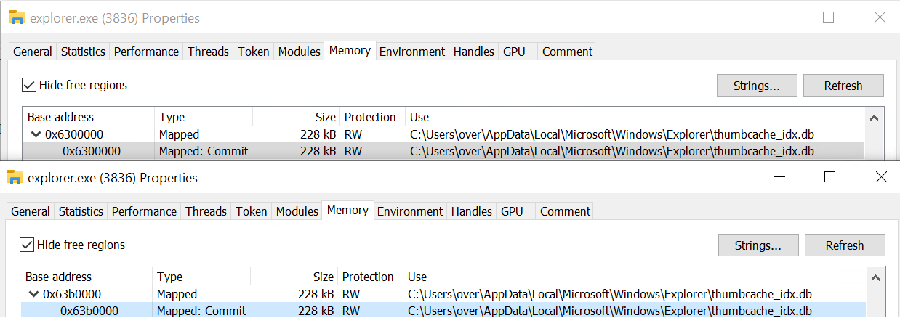

# Sharing is Caring - Enumerate shared memory mappings on Windows


## Overview

This utility enumerates the various shared memory regions mapped in Windows processes. SiC leverages a Windows driver and the [dbghelp](https://docs.microsoft.com/en-us/windows/win32/debug/dbghelp-functions) APIs to scan the running processes and find the said regions.


Binaries ready to run are available to download are available in the [release](https://github.com/0vercl0k/sic/releases) section.

Special thanks to [@masthoon](https://github.com/masthoon) for suggesting the idea and [@yrp604](https://github.com/yrp604) for numerous discussions on virtual memory management.

## Usage

In order for SiC to work you need to place `dbghelp.dll` as well as `symsrv.dll` in the directory of the SiC executable. Sic attempts to copy the two files if they are found in the default Windows SDK's Debuggers install location: `c:\Program Files (x86)\Windows Kits\10\Debuggers\<arch>`.

:100: **Without internet**: Download `%SystemRoot%\system32\ntoskrnl.exe`'s PDB manually (using [symchk](https://docs.microsoft.com/en-us/windows-hardware/drivers/debugger/using-symchk) or [WinDbg](https://docs.microsoft.com/en-us/windows-hardware/drivers/debugger/debugger-download-tools) for example) and drop the PDB file in the application directory.

:zap: **With internet**: The dbghelp APIs should interface well with your existing [symbol path](https://docs.microsoft.com/en-us/windows-hardware/drivers/debugger/symbol-path). If you don't have one already set, SiC defines `_NT_SYMBOL_PATH` to `srv*`.

SiC installs a driver in order to be able to scan processes [Virtual Address Descriptors](https://docs.microsoft.com/en-us/windows-hardware/drivers/debugger/-vad) which are software constructs defined by the Windows' kernel to describe a virtual memory region. To be able to install and communicate with the driver it requires SiC to be run from an *Adminstrator Prompt*.

```
SiC - Enumerate shared memory mappings on Windows
Usage: src\x64\Release\sic.exe [OPTIONS]

Options:
  -h,--help                   Print this help message and exit
  --help-all                  Expand all help
  -f,--filer TEXT             Only display shms owned by processes matching this filter
```

The provided driver is [test-signed](https://docs.microsoft.com/en-us/windows-hardware/drivers/install/how-to-test-sign-a-driver-package) and as a result you need to either:

- Turn on [test-signing](https://docs.microsoft.com/en-us/windows-hardware/drivers/install/the-testsigning-boot-configuration-option) in your VM in order to be able to run the driver (`bcdedit.exe -set testsigning on`),
- Turn on [debug](https://docs.microsoft.com/en-us/windows-hardware/drivers/debugger/setting-up-a-network-debugging-connection-automatically) and have a kernel debugger attached.

The driver has been tested on the following platforms:

- :white_check_mark: Windows 10 1809 x64 (cheers [@yrp604](https://github.com/yrp604))
- :white_check_mark: Windows 10 1903 x64
- :white_check_mark: Windows 10 2004 x64

If you have successfully run it on a different platform, please let me know and I will update the list.

## How?

The first thing the SiC driver does is to enumerate processes running on the system. Once it has a list of processes, it iterates through it and visit the VAD tree of each process.

When it finds a VAD that refers to a [Prototype PTE](https://www.codemachine.com/article_protopte.html) it keeps track of the PTE as well as which process has it mapped in its address space.

Once the driver is done scanning all the VAD trees, it basically has built a lookup table that contains every Prototype PTEs and a list of processes that have mapped it in their address spaces. The table is packed and sent to user mode where the user agent can display the information.

## Build

You can open the Visual Studio solution `sic.sln` or build it via the command line with:

```
(base) sic>msbuild /p:Configuration=Release src\sic.sln
Microsoft (R) Build Engine version 16.7.0+b89cb5fde for .NET Framework
Copyright (C) Microsoft Corporation. All rights reserved.

[...]

Build succeeded.
    0 Warning(s)
    0 Error(s)

Time Elapsed 00:00:00.42
```

:warning: The driver only supports 64-bit kernels.

## Somewhat unexpected results

The funiest part of this project was to skim through the results and have a closer look at some of the results that were a bit unexpected. In this section I share (pun not intented) a few of them. Maybe you know what's going on and if that's the case feel free to edit the below and send out a pull request.

### Same physical page mapped more than once

Even though it is possible to map several views of the same underlying memory region at different virtual addresses I was not really expecting seeing this case in processes running on a default installation of Windows:

```
ProtoPTE: ffffd80ce21e4d70
  Name: explorer.exe (PID: 3836, EPROCESS: ffffc50b824f6080) at 00000000063b0000-00000000063e8000
  Name: explorer.exe (PID: 3836, EPROCESS: ffffc50b824f6080) at 0000000006300000-0000000006338000
```

The output above means that the physical page described by the PrototypePTE `ffffd80ce21e4d70` is mapped at two different virtual addresses in the same `explorer.exe` process: at `00000000063b0000` and at `0000000006300000`.

If we attach a user mode WinDbg to `3836` and dump the two addresses we have:

```
0:100> db 00000000063b0000 l10
00000000`063b0000  0c 00 30 20 49 4d 4d 4d-20 00 00 00 00 00 00 00  ..0 IMMM .......

0:100> db 0000000006300000 l10
00000000`06300000  0c 00 30 20 49 4d 4d 4d-20 00 00 00 00 00 00 00  ..0 IMMM .......
```

Indeed, the region looks like the same which is expected. Now, if we have a look at those two virtual addresses in [Process Hacker](https://processhacker.sourceforge.io/) we learn a little bit more:



According to ProcessHacker the region is backed by the following file: `C:\Users\over\AppData\Local\Microsoft\Windows\Explorer\thumbcache_idx.db`. Both mappings are readables/writeables.

We can also triple check the above with a kernel debugger if we attach ourselves to `explorer.exe`:

```
kd> .process /i ffffc50b824f6080
You need to continue execution (press 'g' <enter>) for the context
to be switched. When the debugger breaks in again, you will be in
the new process context.

kd> g
[...]

kd> !vtop 15fd2000 063b0000
Amd64VtoP: Virt 00000000063b0000, pagedir 0000000015fd2000
Amd64VtoP: PML4E 0000000015fd2000
Amd64VtoP: PDPE 0000000026736000
Amd64VtoP: PDE 000000000b077188
Amd64VtoP: PTE 000000002032ed80
Amd64VtoP: Mapped phys 0000000020bcb000
Virtual address 63b0000 translates to physical address 20bcb000.

kd> !vtop 15fd2000 06300000
Amd64VtoP: Virt 0000000006300000, pagedir 0000000015fd2000
Amd64VtoP: PML4E 0000000015fd2000
Amd64VtoP: PDPE 0000000026736000
Amd64VtoP: PDE 000000000b077188
Amd64VtoP: PTE 000000002032e800
Amd64VtoP: Mapped phys 0000000020bcb000
Virtual address 6300000 translates to physical address 20bcb000.

kd> !db 0000000020bcb000 l10
#20bcb000 0c 00 30 20 49 4d 4d 4d-20 00 00 00 00 00 00 00 ..0 IMMM .......
```

We can also verify that the Prototype PTE lives in the paged pool and is owned by the `mm` subsystem:

```
kd> !pool ffffd80ce21e4d70
Pool page ffffd80ce21e4d70 region is Paged pool
*ffffd80ce21e4d60 size:  1e0 previous size:    0  (Allocated) *MmSt
		Pooltag MmSt : Mm section object prototype ptes, Binary : nt!mm
```

Cool so both `063b0000` and `06300000` maps PFN `20bcb`. Why or how - who knows?

### Mapping it like it's hot, mapping it like it's hot

Another interesting result was the below Prototype PTE mapped in a large number of processes:

```
ProtoPTE: ffffd80cdc802050
  Name: sic.exe (PID: 1112, EPROCESS: ffffc50b824670c0) at 000001ce98090000-000001ce980aa000
  Name: mpcmdrun.exe (PID: 4188, EPROCESS: ffffc50b855340c0) at 000001b547e20000-000001b547e3a000
  Name: cmd.exe (PID: 6720, EPROCESS: ffffc50b846e8080) at 0000025cb6010000-0000025cb602a000
  Name: runtimebroker.exe (PID: 6656, EPROCESS: ffffc50b846210c0) at 000001e863e40000-000001e863e5a000
  Name: conhost.exe (PID: 6276, EPROCESS: ffffc50b855a4480) at 0000023b115a0000-0000023b115ba000
  Name: powershell.exe (PID: 6232, EPROCESS: ffffc50b843f3440) at 000001c0e8810000-000001c0e882a000
  Name: skypeapp.exe (PID: 3668, EPROCESS: ffffc50b849532c0) at 0000020540610000-000002054062a000
  Name: svchost.exe (PID: 5740, EPROCESS: ffffc50b7f682080) at 0000022742850000-000002274286a000
  Name: runtimebroker.exe (PID: 4680, EPROCESS: ffffc50b83e350c0) at 000001bf2bef0000-000001bf2bf0a000
  Name: microsoft.photos.exe (PID: 1424, EPROCESS: ffffc50b8387c0c0) at 000001789f400000-000001789f41a000
  Name: svchost.exe (PID: 3804, EPROCESS: ffffc50b80f534c0) at 0000023831ba0000-0000023831bba000
  Name: svchost.exe (PID: 464, EPROCESS: ffffc50b83af8240) at 00000294345a0000-00000294345ba000
  Name: dllhost.exe (PID: 5768, EPROCESS: ffffc50b830dd080) at 000001c868db0000-000001c868dca000
  Name: runtimebroker.exe (PID: 3120, EPROCESS: ffffc50b824d5080) at 00000230829b0000-00000230829ca000
  Name: shellexperiencehost.exe (PID: 2812, EPROCESS: ffffc50b8271f080) at 000001eb906a0000-000001eb906ba000
  Name: securityhealthhost.exe (PID: 2972, EPROCESS: ffffc50b8267e080) at 000001e5defe0000-000001e5deffa000
  Name: windowsinternal.composableshell.experiences.textinput.inputapp.exe (PID: 4296, EPROCESS: ffffc50b7f660080) at 000001fbaf860000-000001fbaf87a000
  Name: wudfhost.exe (PID: 968, EPROCESS: ffffc50b82692080) at 0000026e02330000-0000026e0234a000
  Name: onedrive.exe (PID: 5252, EPROCESS: ffffc50b8266a080) at 0000000000180000-000000000019a000
  Name: securityhealthservice.exe (PID: 6080, EPROCESS: ffffc50b82525080) at 000001c6def70000-000001c6def8a000
  Name: securityhealthsystray.exe (PID: 6056, EPROCESS: ffffc50b824be080) at 000001a3d4d00000-000001a3d4d1a000
  Name: runtimebroker.exe (PID: 5912, EPROCESS: ffffc50b825550c0) at 0000022246b10000-0000022246b2a000
  Name: microsoftedgesh.exe (PID: 5412, EPROCESS: ffffc50b834640c0) at 0000028093c50000-0000028093c6a000
  Name: microsoftedgecp.exe (PID: 5368, EPROCESS: ffffc50b8269e080) at 000001c14af30000-000001c14af4a000
  Name: runtimebroker.exe (PID: 5316, EPROCESS: ffffc50b8309f240) at 00000228865c0000-00000228865da000
  Name: windows.warp.jitservice.exe (PID: 5240, EPROCESS: ffffc50b82679080) at 0000023effd70000-0000023effd8a000
  Name: browser_broker.exe (PID: 5144, EPROCESS: ffffc50b81b8b380) at 00000237b65b0000-00000237b65ca000
  Name: svchost.exe (PID: 5128, EPROCESS: ffffc50b81b8c2c0) at 0000014d1faa0000-0000014d1faba000
  Name: microsoftedge.exe (PID: 3488, EPROCESS: ffffc50b81725080) at 000001f817590000-000001f8175aa000
  Name: applicationframehost.exe (PID: 5052, EPROCESS: ffffc50b832424c0) at 000001ddc89c0000-000001ddc89da000
  Name: runtimebroker.exe (PID: 4900, EPROCESS: ffffc50b8323d4c0) at 000002346f830000-000002346f84a000
  Name: searchui.exe (PID: 4732, EPROCESS: ffffc50b830850c0) at 000001ff94520000-000001ff9453a000
  Name: runtimebroker.exe (PID: 4544, EPROCESS: ffffc50b830a70c0) at 00000223465e0000-00000223465fa000
  Name: startmenuexperiencehost.exe (PID: 4260, EPROCESS: ffffc50b81b020c0) at 000001c6dce90000-000001c6dceaa000
  Name: svchost.exe (PID: 4024, EPROCESS: ffffc50b82717340) at 0000021772760000-000002177277a000
  Name: tabtip.exe (PID: 3964, EPROCESS: ffffc50b826870c0) at 000001bb2b5b0000-000001bb2b5ca000
  Name: rdpinput.exe (PID: 3868, EPROCESS: ffffc50b825a3080) at 0000020533f00000-0000020533f1a000
  Name: explorer.exe (PID: 3836, EPROCESS: ffffc50b824f6080) at 0000000000c20000-0000000000c3a000
  Name: ctfmon.exe (PID: 3652, EPROCESS: ffffc50b82434300) at 000001bc66370000-000001bc6638a000
  Name: taskhostw.exe (PID: 3480, EPROCESS: ffffc50b7f69b380) at 00000202bc9a0000-00000202bc9ba000
  Name: svchost.exe (PID: 3380, EPROCESS: ffffc50b817690c0) at 000001d641130000-000001d64114a000
  Name: sihost.exe (PID: 3364, EPROCESS: ffffc50b81acf080) at 000001fc0d570000-000001fc0d58a000
  Name: rdpclip.exe (PID: 3344, EPROCESS: ffffc50b7d929080) at 000001f78ffb0000-000001f78ffca000
  Name: svchost.exe (PID: 3096, EPROCESS: ffffc50b81af8240) at 0000018a19ef0000-0000018a19f0a000
  Name: dwm.exe (PID: 768, EPROCESS: ffffc50b7b7b2080) at 00000262e5340000-00000262e535a000
  Name: fontdrvhost.exe (PID: 3020, EPROCESS: ffffc50b7b795080) at 000001a1432b0000-000001a1432ca000
  Name: winlogon.exe (PID: 640, EPROCESS: ffffc50b814d0080) at 000001bf46e50000-000001bf46e6a000
  Name: csrss.exe (PID: 1376, EPROCESS: ffffc50b7d90e080) at 0000028658810000-000002865882a000
  Name: svchost.exe (PID: 1768, EPROCESS: ffffc50b7d998080) at 0000020eecc50000-0000020eecc6a000
  Name: searchindexer.exe (PID: 2268, EPROCESS: ffffc50b7d997240) at 000002ab039d0000-000002ab039ea000
  Name: svchost.exe (PID: 2944, EPROCESS: ffffc50b7f6440c0) at 000001c9f39b0000-000001c9f39ca000
  Name: sgrmbroker.exe (PID: 488, EPROCESS: ffffc50b81480240) at 0000016eb5dc0000-0000016eb5dda000
  Name: msmpeng.exe (PID: 2232, EPROCESS: ffffc50b80eeb380) at 00000244c1830000-00000244c184a000
  Name: svchost.exe (PID: 2152, EPROCESS: ffffc50b80ddb080) at 000002099fb80000-000002099fb9a000
  Name: svchost.exe (PID: 2096, EPROCESS: ffffc50b80e41300) at 000001eefd1e0000-000001eefd1fa000
  Name: svchost.exe (PID: 1508, EPROCESS: ffffc50b80d922c0) at 000001ced6b90000-000001ced6baa000
  Name: spoolsv.exe (PID: 1472, EPROCESS: ffffc50b80d90200) at 0000000000bc0000-0000000000bda000
  Name: svchost.exe (PID: 1996, EPROCESS: ffffc50b80d32080) at 00000133132b0000-00000133132ca000
  Name: svchost.exe (PID: 1988, EPROCESS: ffffc50b80d2f340) at 0000021b1dd90000-0000021b1ddaa000
  Name: svchost.exe (PID: 1920, EPROCESS: ffffc50b7b797080) at 0000029efea00000-0000029efea1a000
  Name: vssvc.exe (PID: 1784, EPROCESS: ffffc50b7b78e080) at 00000195efd00000-00000195efd1a000
  Name: svchost.exe (PID: 1464, EPROCESS: ffffc50b8089a240) at 000001e85ebd0000-000001e85ebea000
  Name: svchost.exe (PID: 1360, EPROCESS: ffffc50b7b6bc0c0) at 000001e534210000-000001e53422a000
  Name: svchost.exe (PID: 1308, EPROCESS: ffffc50b800dd240) at 00000211c1c30000-00000211c1c4a000
  Name: svchost.exe (PID: 1080, EPROCESS: ffffc50b808a02c0) at 0000023eec4b0000-0000023eec4ca000
  Name: svchost.exe (PID: 1064, EPROCESS: ffffc50b8089c280) at 00000200e9810000-00000200e982a000
  Name: svchost.exe (PID: 740, EPROCESS: ffffc50b8084a2c0) at 000002b151a00000-000002b151a1a000
  Name: svchost.exe (PID: 540, EPROCESS: ffffc50b808482c0) at 000001a785fb0000-000001a785fca000
  Name: svchost.exe (PID: 544, EPROCESS: ffffc50b80834240) at 0000020c75aa0000-0000020c75aba000
  Name: svchost.exe (PID: 444, EPROCESS: ffffc50b8082e2c0) at 00000194bcfd0000-00000194bcfea000
  Name: dwm.exe (PID: 1012, EPROCESS: ffffc50b801d3080) at 0000019ca4dd0000-0000019ca4dea000
  Name: logonui.exe (PID: 972, EPROCESS: ffffc50b801c8080) at 00000250924f0000-000002509250a000
  Name: svchost.exe (PID: 864, EPROCESS: ffffc50b8016a2c0) at 00000196f15f0000-00000196f160a000
  Name: svchost.exe (PID: 820, EPROCESS: ffffc50b800d9240) at 0000025613a90000-0000025613aaa000
  Name: fontdrvhost.exe (PID: 752, EPROCESS: ffffc50b800a4080) at 000002806b080000-000002806b09a000
  Name: fontdrvhost.exe (PID: 744, EPROCESS: ffffc50b800a2140) at 0000011c7aef0000-0000011c7af0a000
  Name: lsass.exe (PID: 688, EPROCESS: ffffc50b80091080) at 00000171ac150000-00000171ac16a000
  Name: services.exe (PID: 656, EPROCESS: ffffc50b80079080) at 000002190de50000-000002190de6a000
  Name: winlogon.exe (PID: 608, EPROCESS: ffffc50b7f9dd140) at 000002c7ebda0000-000002c7ebdba000
  Name: csrss.exe (PID: 556, EPROCESS: ffffc50b7f9df140) at 000001b7035d0000-000001b7035ea000
  Name: wininit.exe (PID: 548, EPROCESS: ffffc50b7f9c9080) at 00000208f83c0000-00000208f83da000
  Name: csrss.exe (PID: 480, EPROCESS: ffffc50b7f8a3140) at 00000160401c0000-00000160401da000
  Name: smss.exe (PID: 368, EPROCESS: ffffc50b7dadb040) at 0000024005d80000-0000024005d9a000
```

Same as above, if we attach a user mode WinDbg to `cmd.exe` and dump the beginning of the region we get:

```
0:001> db 0000025cb6010000 l10
0000025c`b6010000  06 00 00 00 8c a1 01 00-00 00 00 00 32 03 00 00  ............2...
```

Same on `MicrosoftEdge.exe`:

```
0:000> db 000001f817590000
000001f8`17590000  06 00 00 00 8c a1 01 00-00 00 00 00 32 03 00 00  ............2...
```

According to above the output of the tool looks legit. This time Process Hacker tells us this is a read-only region (at least in `cmd.exe` and `MicrosoftEdge.exe`):


Again, no clue what this really is :)